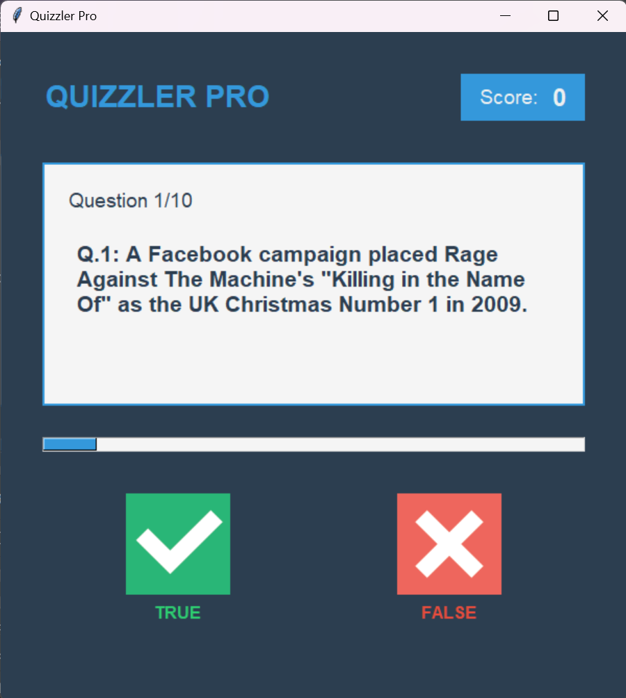

# Quizzler Pro

 

## Overview


Quizzler Pro is an interactive true/false quiz application built with Python and Tkinter. The application features a modern, responsive UI with visual feedback, progress tracking, and a score counter.

## Features

- **Modern UI**: Clean interface with a color scheme of dark blue-gray, bright blue, and red accents
- **Responsive Design**: Adjusts to window resizing with dynamic font sizing and layout adjustments
- **Visual Feedback**: Color-coded responses for correct and incorrect answers
- **Progress Tracking**: Visual progress bar showing quiz completion status
- **Scrollable Questions**: Long questions are scrollable for better readability
- **Score Counter**: Real-time score tracking as you progress through questions
- **End-of-Quiz Summary**: Detailed results with performance feedback when the quiz completes

## Screenshots

*[Screenshots would be placed here]*

## Requirements

- Python 3.x
- Tkinter (usually comes pre-installed with Python)
- Images for true and false buttons (`true.png` and `false.png` in an `images` folder)

## Installation

1. Clone or download this repository
2. Ensure you have the required image files in an `images` directory:
   - `images/true.png`
   - `images/false.png`
3. Make sure you have the `quiz_brain.py` file that contains the `QuizBrain` class

## Project Structure

```
quizzler_pro/
├── main.py              # Entry point for the application
├── quiz_interface.py    # UI implementation (the code provided)
├── quiz_brain.py        # Quiz logic implementation
└── images/
    ├── true.png         # True button image
    └── false.png        # False button image
```

## Usage

Run the application by executing the main script:

```bash
python main.py
```

- Click the ✓ (True) or ✗ (False) buttons to answer questions
- The progress bar updates as you move through the quiz
- Visual feedback shows whether your answer was correct or incorrect
- When the quiz is complete, a summary will be displayed with your score
- Click "Play Again" to restart the quiz

## How It Works

The application is built using Object-Oriented Programming principles:

1. `QuizBrain` (not shown in provided code) handles the quiz logic, including:
   - Tracking the current question
   - Checking answers
   - Calculating scores

2. `QuizInterface` (provided code) handles the UI, including:
   - Rendering the question text
   - Managing the answer buttons
   - Providing visual feedback
   - Updating the progress bar
   - Resizing content for different window sizes

## Customization

You can customize the quiz by modifying the following:

- **Color Scheme**: Edit the color variables in the `__init__` method
- **Fonts**: Modify the font specifications in the `__init__` method
- **Feedback Duration**: Change the `feedback_duration` variable (in milliseconds)
- **Questions**: Add or modify questions in your quiz data source

## Contributing

Contributions are welcome! Feel free to submit pull requests or open issues to improve the application.

## License

[Your License Here]

## Acknowledgements

- Icons for true and false buttons
- Any libraries or resources you've used
